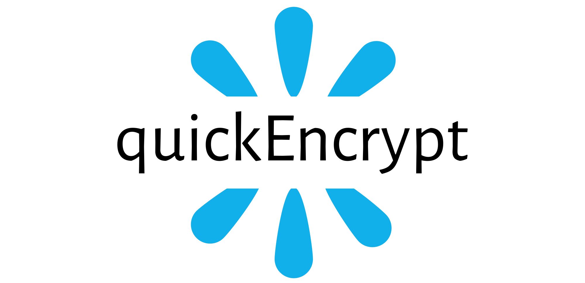

<p align="center"></p>

<h1 align="center"> QuickEncrypt (WIP)</h1>

<p align="center"> A minimal, easy to use hashing and encryption package. </p>

---
[](https://github.com/Febzey/gotime/graphs/commit-activity) [](https://www.javascript.com) [](https://npmjs.com/package/@febzey/gotime) [](https://GitHub.com/Febzey/gotime/issues/)

<p align="center">

</p>

<p> QuickEncrypt is a nodejs package used for quickly and easily encrypting strings, this package relies solely on node's build in Crypto module, QuickEncrypt just makes it easier to use.</p>

<h3> List of features </h3>

<ul>
  <li>Encrypt strings with common encrypting and hashing algorithims.</li>
  <li>Multiple encryption options.</li>
  <li>Ease of use, beginner friendly.</li>
</ul>

<h3> Download & Installation </h3>

```shell
$ npm i @febzey/quickencrypt
$ yarn add @febzey/quickencrypt
```
<h3>Contributing</h3>
Keep it simple. Keep it minimal. Don't put every single feature just because you can.